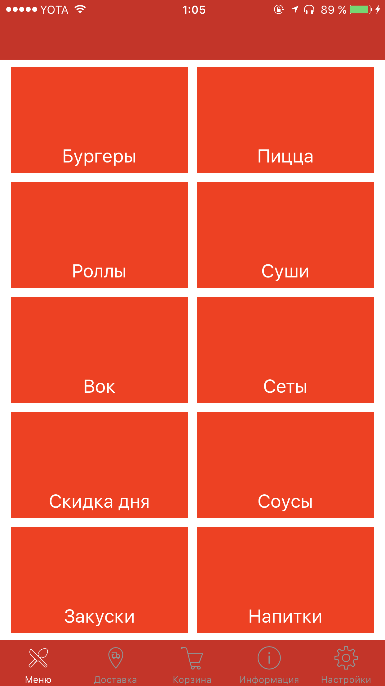
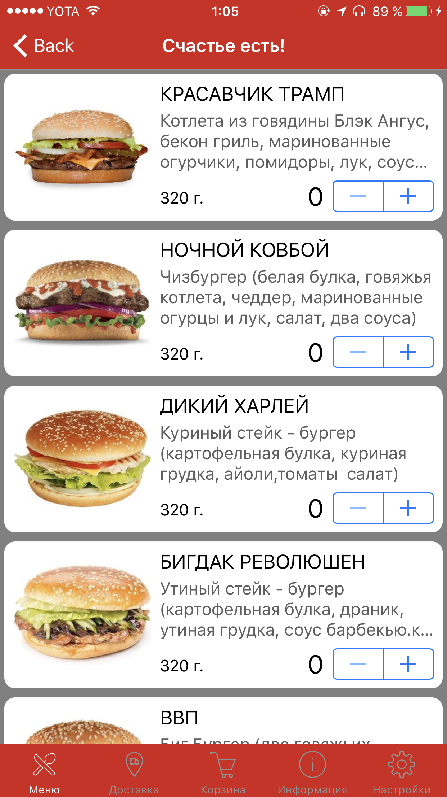
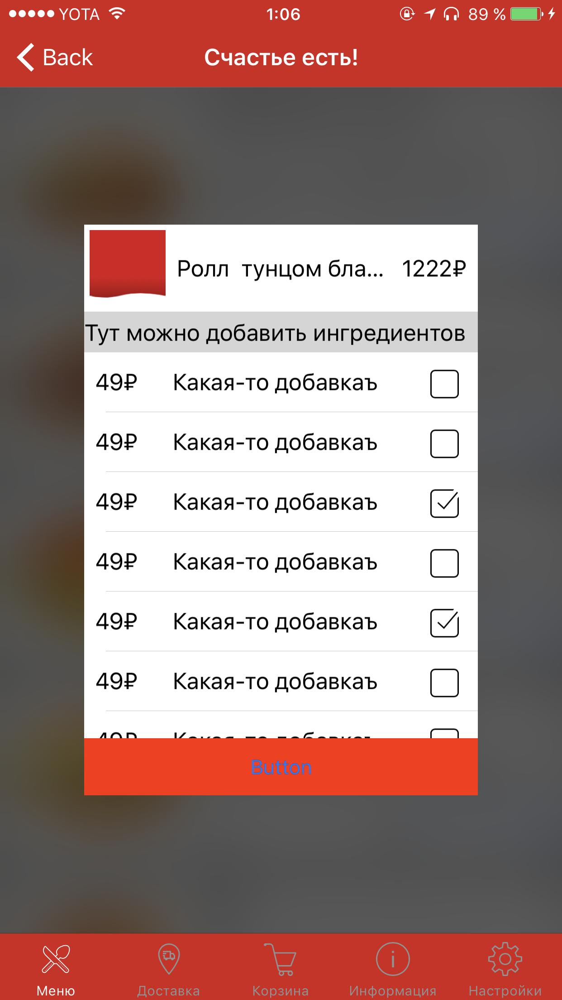

# Мобильное iOS приложение для сервиса "Счастье есть". 
Проект на языке swift 3 для iOS 10.0+. 
## Уже реализовано
- Категории меню
- Список блюд и дополнительное окно выбора ингредиентов
- Корзина

## Предстоит сделать 
- UI
- Систему отслеживания статуса заказа 
- Онлайн оплату

----------------------------------------------------------------------------------

        
        
        </img>
        
        

        </img>

